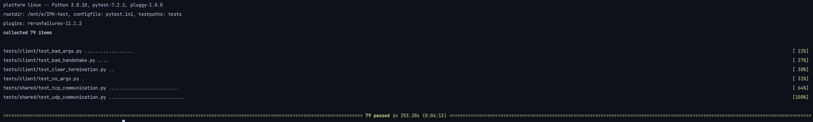

# IPK Client

Implementation of client for IPKCP protocol. Client sends queries to server and prints the response.
The format of queries is described in the [protocol specification](https://git.fit.vutbr.cz/NESFIT/IPK-Projekty/src/branch/master/Project%201/Protocol.md).<sup>[1]</sup>

Client connects to a server using TCP or UDP protocol, which is required by user to specify.
The server and port are also required to be specified by user. If any of the required arguments is missing, the client will print an error and exit.

The client is built utilising Makefile or CMake on UNIX or only CMake if built on Windows, see chapter 4 for more details.

## 1. Usage
### 1.1 Build

```bash
make
```
### 1.2 Run
```bash
./ipkcpc -h <server_IPv4> -p <server_port> -m <protocol>
```
where:
* `<server_IPv4>` - server IPv4 address or hostname
* `<server_port>` - server port
* `<protocol>` - protocol to use (tcp or udp)

### 1.3 Examples
```bash
./ipkcpc -h localhost -p 1234 -m tcp
HELLO
SOLVE (+ 1 2)
BYE
```

```bash
./ipkcpc -h localhost -p 1234 -m udp
(+ 1 2)
(- 123 4)
```

## 2. Behavior
### 2.1 TCP
Client connects to server and sends queries. After sending query, client waits for response from server.
The client has to send `HELLO` query first, otherwise the server will send `BYE` and disconnect the client.
After the hello query, the client can send any number of queries. After sending the last query, the client has to send `BYE` query to signal the server to disconnect and cancel the communication.
The queries for calculation are sent in the format `SOLVE (<query>)`. The server will respond with the result of the calculation or an error, in which case the client reports the error and disconnects.

If the input length is greater than 1024 bytes, the client refuses the query, reports an error and awaits for new query.
If SIGINT signal is received, the client sends `BYE` query to server and gracefully disconnects.
If EOF is received, the client sends `BYE` query to server, unless it has been sent already and then the client disconnects.

### 2.2 UDP
Client sends queries to server and waits for response. The client can send any number of queries.
If the input length is greater than 255 bytes, the client refuses the query, reports an error and awaits for new query.
If SIGINT signal is received, the client gracefully disconnects.
If EOF is received, the client disconnects.

## 3. Testing
For testing I have decided to use pytest <sup>[2]</sup> as I already have some experience with it and is simple to use.

### 3.1 Requirements
* Python 3.8 or higher
* pytest
* CMake

### 3.2 Build
Execute the following command in git repository root directory to build both client and the server:
```bash
cmake -B build
cmake --build build
```

### (OPTIONAL) 3.2.1 create python venv
```bash
python3 -m venv venv
source venv/bin/activate
```

### 3.2.2 install requirements
```bash
pip install -r requirements.txt
```

### 3.3 Run
Execute the following command in git repository root directory to run tests:
```bash
pytest
```
The default configuration is to run tests on localhost on port 2023 using both TCP and UDP protocols.
Sometimes the socket creation fails, so by default all failed tests are rerun 3 times.

### 3.4 Output examples
Examples of test output can be found in [test_output](test_output) directory.



## 4. Windows support
The client is fully supported on Windows. This is achieved by using CMake and Visual Studio build tools to build the client and by using winsock2 library.
The client is built using CMake, not Makefile on Windows. The server, used for testing, is built using Makefile on UNIX or CMake if built on Windows.
Due to the use of Visual Studio build tools, the client requires third party getopt library, which is included in the repository.

### 4.1 CMake on Windows
CMake is a cross-platform build system generator. It is used to generate build files for different build systems, such as Makefile, Visual Studio project files, Xcode project files, etc.
For Windows we need Visual Studio build tools, which can be installed using the following command:
```PowerShell
winget install Microsoft.VisualStudio.2022.BuildTools
```
After installing the build tools we will also need to install CMake. CMake can be installed using the following command:
```PowerShell
winget install kitware.cmake
```
After installing CMake, we can build the client using the following commands:
```PowerShell
cmake -B build
cmake --build build --target ipkcpc --config Release
```

## 5. Theory
### 5.1 TCP
TCP is a connection-oriented protocol.
This means that the client has to establish a connection with the server before sending any data.
The client sends a SYN packet to the server, which responds with a SYN-ACK packet.
After receiving the SYN-ACK packet, the client sends an ACK packet to the server, which confirms the connection.
After the connection is established, the client can send data to the server.
The server sends an ACK packet to the client after receiving the data.
The client sends an ACK packet to the server after receiving the ACK packet from the server.
This is called a three-way handshake. <sup>[3]</sup>

### 5.2 UDP
UDP uses a simple connectionless communication model with a minimum of protocol mechanisms.
UDP provides checksums for data integrity, and port numbers for addressing different functions at the source and destination of the datagram.
It has no handshaking dialogues, and thus exposes the user's program to any unreliability of the underlying network;
there is no guarantee of delivery, ordering, or duplicate protection.
If error-correction facilities are needed at the network interface level,
an application may instead use Transmission Control Protocol (TCP) or Stream Control Transmission Protocol (SCTP)
which are designed for this purpose. <sup>[4]</sup>

## 6. License
This project is licensed under GPL3.0 license.  
getopt.h and getopt.c<sup>[5]</sup> are licensed under the Apache License 2.0 - see the [LICENSE](src/getopt/LICENSE) file for details.


### Author: Jan Kalenda (xkalen07)

## 7. References
[1] : https://git.fit.vutbr.cz/NESFIT/IPK-Projekty/src/branch/master/Project%201/Protocol.md  
[2] : https://docs.pytest.org/en/7.2.x/  
[3] : Transmission Control Protocol. (2023, March 10). In Wikipedia. https://en.wikipedia.org/wiki/Transmission_Control_Protocol#Connection_establishment  
[4] : User Datagram Protocol. (2023, March 16). In Wikipedia. https://en.wikipedia.org/wiki/User_Datagram_Protocol  
[5] : getopt.h and getopt.c. https://github.com/iotivity/iotivity/tree/master/resource/c_common/windows/src  
