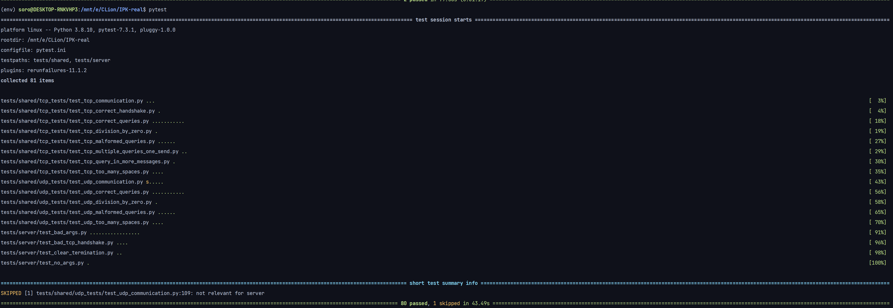

# IPKCP Server - IOTA

Implementation of a server for IPKCP protocol. Server receives queries from clients and calculates the result of the query.
The format of queries is described in the [protocol specification](https://git.fit.vutbr.cz/NESFIT/IPK-Projekty/src/branch/master/Project%201/Protocol.md).<sup>[1]</sup>

Server supports both TCP and UDP protocols, which is required by user to specify.
The IP address and port are also required to be specified by user. If any of the required arguments is missing, the server will print an error and exit.

The server is built utilising Makefile or CMake on UNIX or only CMake if built on Windows, see chapter 4 for more details.

## 1. Usage
### 1.1 Build

```bash
make
```
### 1.2 Run
```bash
./ipkcpd -h <server_IPv4> -p <server_port> -m <protocol>
```
where:
* `<server_IPv4>` - server IPv4 address or hostname
* `<server_port>` - server port
* `<protocol>` - protocol to use (tcp or udp)

## 2. Behavior
The server logs all the queries and responses to the standard output. The server also logs all the errors to the standard error. The incoming connections are also logged on standard output.

### 2.1 TCP
The server listens for incoming connections. If the server receives a connection request, it accepts it and stores the record of the connection in internal array.
The server then waits for the client to send a query. The server expect certain format of the query, which is described in the [protocol specification](https://git.fit.vutbr.cz/NESFIT/IPK-Projekty/src/branch/master/Project%201/Protocol.md).<sup>[1]</sup>
The first query is always a `HELLO` message, which can be followed by any number of `SOLVE` queries.
When the client sends a `SOLVE` query, the server calculates the result and sends it back to the client.
When the client sends a `BYE` query, the server closes the connection.

If the server receives a query with invalid format, it closes the connection.
In TCP mode, the server can handle up to 30 connections at the same time.

### 2.2 UDP
The server listens for incoming queries. If the server receives a query, it checks the format of the query, which is described in the [protocol specification](https://git.fit.vutbr.cz/NESFIT/IPK-Projekty/src/branch/master/Project%201/Protocol.md).<sup>[1]</sup>
The query cannot be longer than 255 bytes, due to the limitation of the IPKCP protocol. If the query is split between numerous datagram, the server will not be able to reconstruct the query.
When the server receives a query, it takes X characters from the query, where X is the length of the query determined by the second byte of the message.
The server then calculates the result of the query and sends it back to the client.

If the server receives a query with invalid format, it responses with an error message.
In UDP mode, the server can handle unspecified number of clients.

## 3. Testing
For testing, I have decided to use pytest <sup>[2]</sup> as I already have some experience with it and is simple to use.

### 3.1 Requirements
* Python 3.8 or higher
* pytest
* CMake

### 3.2 Build
Execute the following command in git repository root directory to build both client and the server:
```bash
cmake -B build
cmake --build build
```

### (OPTIONAL) 3.2.1 create python venv
```bash
python3 -m venv venv
source venv/bin/activate
```

### 3.2.2 install requirements
```bash
pip install -r tests/requirements.txt
```

### 3.3 Run
Execute the following command in git repository root directory to run tests:
```bash
pytest
```
The default configuration is to run tests on localhost on port 2023 using both TCP and UDP protocols.
Sometimes the socket creation fails, so by default all failed tests are rerun 3 times.

### 3.4 Tests
The tests are located in [tests](../tests) directory.
The tests are divided into 3 directories: [client](../tests/client), [server](../tests/server) and [shared](../tests/shared).
The [server](../tests/server) directory contains the following tests:
 - [bad_args](../tests/server/test_bad_args.py) - tests if the server exits with error when the required arguments are missing or are wrong
 - [bad_tcp_handshake](../tests/server/test_bad_tcp_handshake.py) - tests if the server disconnects the client when the client sends a bad TCP handshake
 - [clear_termination](../tests/server/test_clear_termination.py) - tests if the server cleanly terminates when receiving a SIGINT signal
 - [no_args](../tests/server/test_no_args.py) - tests if the server exits with error when no arguments are provided

The [shared](../tests/shared) directory contans 2 more subdirectories: [tcp](../tests/shared/tcp_tests) and [udp](../tests/shared/udp_tests).
 - [tcp](../tests/shared/tcp_tests) - contains tests for TCP protocol, testing the overall TCP functionality and the expression evaluation
    - [tcp_communication](../tests/shared/tcp_tests/test_tcp_communication.py) - tests if the server correctly handles TCP communication with more clients
    - [tcp_correct_handshake](../tests/shared/tcp_tests/test_tcp_correct_handshake.py) - tests if the server correctly handles TCP handshake
    - [tcp_correct_queries](../tests/shared/tcp_tests/test_tcp_correct_queries.py) - tests if the server correctly handles TCP queries, like addition, subtraction, multiplication, division, messages of numerous length or complexity, etc.
    - [tcp_division_by_zero](../tests/shared/tcp_tests/test_tcp_division_by_zero.py) - tests if the server correctly handles division by zero
    - [tcp_malformed_queries](../tests/shared/tcp_tests/test_tcp_malformed_queries.py) - tests if the server correctly handles malformed TCP queries
    - [tcp_multiple_queries_in_one_message](../tests/shared/tcp_tests/test_tcp_multiple_queries_one_send.py) - tests if the server correctly handles multiple queries in one message
    - [tcp_one_query_in_multiple_messages](../tests/shared/tcp_tests/test_tcp_query_in_more_messages.py) - tests if the server correctly handles one query in multiple messages
    - [tcp_too_many_spaces](../tests/shared/tcp_tests/test_tcp_too_many_spaces.py) - tests if the server correctly handles queries with too many spaces
 - [udp](../tests/shared/udp_tests) - contains tests for UDP protocol, testing the overall UDP functionality and the expression evaluation
    - [udp_communication](../tests/shared/udp_tests/test_udp_communication.py) - tests if the server correctly handles UDP communication with more clients
    - [udp_correct_queries](../tests/shared/udp_tests/test_udp_correct_queries.py) - tests if the server correctly handles UDP queries, like addition, subtraction, multiplication, division, messages of numerous length or complexity, etc.
    - [udp_division_by_zero](../tests/shared/udp_tests/test_udp_division_by_zero.py) - tests if the server correctly handles division by zero
    - [udp_malformed_queries](../tests/shared/udp_tests/test_udp_malformed_queries.py) - tests if the server correctly handles malformed UDP queries
    - [udp_too_many_spaces](../tests/shared/udp_tests/test_udp_too_many_spaces.py) - tests if the server correctly handles queries with too many spaces


### 3.5 Output examples
Examples of test output can be found in [test_output](test_output) directory.



## 4. Windows support
The server is fully supported on Windows. This is achieved by using CMake and Visual Studio build tools to build the server and by using winsock2 library.
The server is built using CMake, not Makefile on Windows. The client, used for testing, is built using Makefile on UNIX or CMake if built on Windows.
Due to the use of Visual Studio build tools, both client and server require third party getopt library, which is included in the repository.

### 4.1 CMake on Windows
CMake is a cross-platform build system generator. It is used to generate build files for different build systems, such as Makefile, Visual Studio project files, Xcode project files, etc.
For Windows we need Visual Studio build tools, which can be installed using the following command:
```PowerShell
winget install Microsoft.VisualStudio.2022.BuildTools
```
After installing the build tools we will also need to install CMake. CMake can be installed using the following command:
```PowerShell
winget install kitware.cmake
```
After installing CMake, we can build the server using the following commands:
```PowerShell
cmake -B build
cmake --build build --target ipkcpd --config Release
```

## 5. Theory
### 5.1 TCP
TCP is a connection-oriented protocol.
This means that the client has to establish a connection with the server before sending any data.
The client sends a SYN packet to the server, which responds with a SYN-ACK packet.
After receiving the SYN-ACK packet, the client sends an ACK packet to the server, which confirms the connection.
After the connection is established, the client can send data to the server.
The first data sent has to be a `HELLO` message, which is used to identify the client, simulating the handshake that is being done in TCP protocol.
The server sends an ACK packet to the client after receiving the data.
The client sends an ACK packet to the server after receiving the ACK packet from the server.
This is called a three-way handshake. <sup>[3]</sup>

Due to the nature of TCP, the server can send data to the client at any time, however wihtout use of techniques like
threading, multi-process, asynchronous I/O, select or poll, the server can only send and receive messages from one client at a time.

The connection is closed by sending a FIN packet from the client to the server, which is invoked by wrong query or by the client sending a `BYE` message.

### 5.2 UDP
UDP uses a simple connectionless communication model with a minimum of protocol mechanisms.
UDP provides checksums for data integrity, and port numbers for addressing different functions at the source and destination of the datagram.
In IPKCP, UDP has a format specified in the assignment.<sup>[1]</sup>
It has no handshaking dialogues, and thus exposes the user's program to any unreliability of the underlying network;
there is no guarantee of delivery, ordering, or duplicate protection. <sup>[4]</sup>

Unlike TCP, UDP is connectionless, which means that the client does not have to establish a connection with the server before sending any data and thus has no limit on number of clients.


## 6. Implementation
The server is implemented using C++20 and utilizes 3 classes: `Server`, `TCPServer` and `UDPServer`.
The `Server` class contains 3 virtual methods (communicate(), SetUpServer(), destructor), which are implemented by `TCPServer` and `UDPServer`, which inherit from `Server`.
The `TCPServer` and `UDPServer` classes contain the implementation of the TCP and UDP server respectively.

The `Server` class implements the following methods:
- `SetUpServer()` - abstract method, sets up the server socket
- `communicate()` - abstract method, receives data from the socket and sends the result back to the client
- `destructor()` - abstract method, closes the server socket and all the connections
- `parse()` - parses the query and returns the result
- `calculate()` - calculates the result of the expression
- `get_address()` - returns the address struct of the server

### 6.1 TCP
The server uses `std::array` to store the records of the connections. The array is initialized with `0` values.
When the server receives a connection request, it accepts it and stores the record of the connection in the first free position in the array.
The server utilizes `select` function to check if there is any data to read from the socket.

When the server receives a SIGINT signal, it closes all the connections using the class destructor and exits.

The `TCPServer` implements the following methods:
- `SetUpServer()` - sets up the server socket
- `communicate()` - receives data from the socket and sends the result back to the client
- `destructor()` - closes the server socket and all the connections
- `create_tcp_socket()` - creates a TCP socket
- `get_tcp_response()` - receives the response from the expression parser
- `get_tcp_query()` - receives the complete query from the client
- `send_tcp_message()` - sends data to the socket

### 6.2 UDP
In UDP mode, the server does not store any records of the connections. The server uses `recvfrom` function to receive data from the socket.

The `UDPServer` implements the following methods:
- `SetUpServer()` - sets up the server socket
- `communicate()` - receives data from the socket and sends the result back to the client
- `destructor()` - closes the server socket
- `create_udp_socket()` - creates a UDP socket
- `get_udp_response()` - receives the response from the expression parser
- `send_udp_message()` - sends data to the socket

### 6.3 Expression parser
The expression parser is implemented using predictive parsing. The parser uses a stack to store the required tokens. Numbers are stored as `double` and operators are stored as `string`.
The parser uses enumeration to tokenize the input string. For each token, the parser checks if the token is expected. If the token is not expected, the parser throws an error.
If inner expression is encountered, the parser calls itself recursively.
The grammar of the result disallows negative or floating point numbers, which are not allowed in the protocol.


## 7. License
This project is licensed under GPL3.0 license.  
getopt.h and getopt.c<sup>[5]</sup> are licensed under the Apache License 2.0 - see the [LICENSE](../Project-1/getopt/LICENSE) file for details.


### Author: Jan Kalenda (xkalen07)

## 8. References
[1] : https://git.fit.vutbr.cz/NESFIT/IPK-Projekty/src/branch/master/Project%201/Protocol.md  
[2] : https://docs.pytest.org/en/7.2.x/  
[3] : https://en.wikipedia.org/wiki/Transmission_Control_Protocol#Connection_establishment  
[4] : https://en.wikipedia.org/wiki/User_Datagram_Protocol  
[5] : https://github.com/iotivity/iotivity/tree/master/resource/c_common/windows/src  
